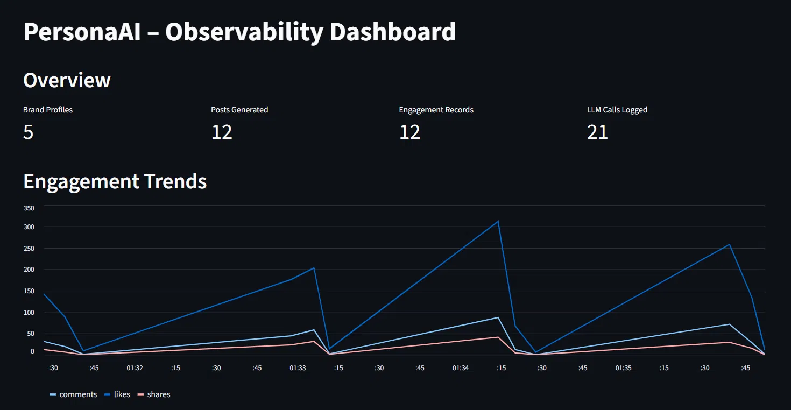
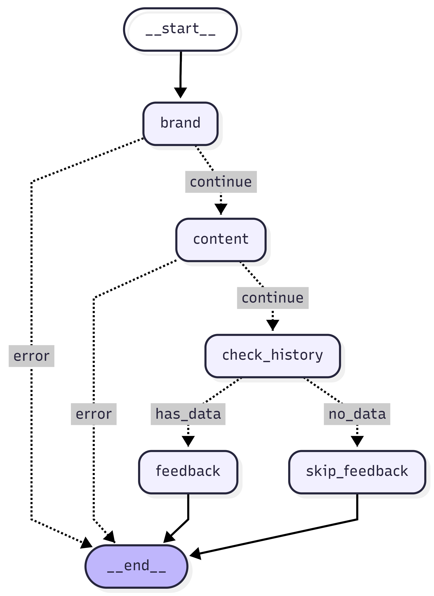

[](https://github.com/BurraRohan/PersonaAI/actions/workflows/tests.yml)

# PersonaAI – Personal Branding Intelligence Agent

A multi-agent system that helps professionals build a consistent LinkedIn personal brand through an end-to-end feedback loop.

Built with **Python, FastAPI, LangChain, LangGraph, Groq, SQLAlchemy and Streamlit.**

---

## What It Does

PersonaAI structures the guesswork out of personal branding. It builds a brand profile, writes posts aligned to that profile, scores a draft before you publish it, records how the post actually performed, and turns that history into concrete strategy advice.

Feedback quality improves as engagement history accumulates — the model is given more real data to reason over. Nothing is trained or fine-tuned.

```
Define Brand → Generate Post → Predict Engagement → Publish → Log Metrics → Get Feedback → Improve
```

---

## Features

- **3 ReAct agents** — each chooses its own tools at runtime, with the tool-call trace returned to the caller
- **Conditional graph routing** — the orchestrator branches on error state and on data availability
- **Engagement prediction** — the model rates a draft on brand alignment, hook strength, readability and call-to-action; the overall score is a weighted composite computed in Python, not taken from the model
- **Human-in-the-loop review** — generated posts start `pending`; a person approves or rejects each one after seeing its score, and nothing enters the engagement pipeline unapproved
- **Feedback loop** — analyses recorded engagement and recommends specific changes, referencing actual post topics and numbers
- **Prompt versioning** — templates stored in the database, with rollback to any prior version in a single API call
- **Audit logging** — every LLM call recorded with a trace ID, model, prompt version, latency and status
- **API security** — bearer token auth, per-endpoint rate limiting, HTML escaping on all rendered model output
- **Prometheus metrics** — request counts, latency histograms and error rates at `/metrics`
- **Streamlit dashboard** — engagement trends and audit log inspection
- **Docker packaging** — `docker-compose` with a named volume and health checks
- **Continuous integration** — GitHub Actions runs the full test suite on every push



---

## Quick Start

### Prerequisites

- Python 3.10+
- A free Groq API key → [console.groq.com/keys](https://console.groq.com/keys)

### Setup

```bash
cd PersonaAI

python -m venv venv
# source venv/bin/activate     # macOS / Linux
venv\Scripts\activate      # Windows

pip install -r requirements.txt

# cp .env.template .env        # macOS / Linux
copy .env.template .env    # Windows
```

Open `.env` and set both keys. `API_KEY` is required — the app refuses to start without it rather than falling back to a default value. Generate one with:

```bash
python -c "import secrets; print(secrets.token_urlsafe(32))"
```

### Run

```bash
uvicorn main:app --reload
```

|                    |                               |
| ------------------ | ----------------------------- |
| App UI             | http://127.0.0.1:8000         |
| Swagger docs       | http://127.0.0.1:8000/docs    |
| Prometheus metrics | http://127.0.0.1:8000/metrics |

The UI asks for your API key once and keeps it in `localStorage`, so it survives tab closes and browser restarts. It is never written into the source. To be asked again, type `resetApiKey()` in the browser console.

### Tests

```bash
pytest -q
```

61 tests, all offline — the Groq boundary is stubbed, so the suite covers this project's logic rather than the model's output.

The same suite runs on GitHub Actions on every push to `main` (see
`.github/workflows/tests.yml`). Because nothing hits the network, CI needs only
placeholder values for `API_KEY`, `GROQ_API_KEY` and `GROQ_MODEL` — no real
credentials are stored on GitHub.

### Streamlit dashboard

```bash
streamlit run streamlit_dashboard.py
```

### Docker

```bash
docker-compose up --build
```

---

## Agent Execution

`/brand`, `/generate` and `/feedback` each run a ReAct agent built with `create_react_agent`. The agent selects its own tools at runtime; the API does not call them in a fixed order.

Every response carries two fields that make this inspectable:

| Field            | Meaning                                                                                                                                                                                    |
| ---------------- | ------------------------------------------------------------------------------------------------------------------------------------------------------------------------------------------ |
| `execution_mode` | `agent` when the agent ran and persisted its work; `direct` when `AGENT_MODE=0` was set deliberately; `fallback_direct` when the agent failed and the single-call path rescued the request |
| `agent_trace`    | Ordered list of the tool calls the model chose, and what each returned                                                                                                                     |

A real trace from `POST /brand`, captured from a live run against Groq:

```json
"execution_mode": "agent",
"agent_trace": [
  { "step": 1, "action": "tool_call",   "tool": "check_existing_profile",  "args": { "name": "Demo User" } },
  { "step": 2, "action": "tool_result", "tool": "check_existing_profile",  "result": "{\"exists\": false}" },
  { "step": 3, "action": "tool_call",   "tool": "generate_brand_strategy", "args": { "name": "Demo User", "role": "SDE-II", "...": "..." } },
  { "step": 4, "action": "tool_result", "tool": "generate_brand_strategy", "result": "{\"tone\": \"Professional yet approachable...\"}" },
  { "step": 5, "action": "tool_call",   "tool": "save_brand_profile",      "args": { "strategy_json": "...", "...": "..." } },
  { "step": 6, "action": "tool_result", "tool": "save_brand_profile",      "result": "{\"id\": 6, \"status\": \"saved\"}" }
]
```

The model was not told to call those tools in that order. It checked for an
existing profile first, saw none, generated a strategy, then persisted it —
choosing each step from the tool descriptions alone. Tool results longer than
400 characters are truncated in the trace to keep responses readable.

### Tools available to each agent

| Agent    | Tools                                                                                |
| -------- | ------------------------------------------------------------------------------------ |
| Brand    | `check_existing_profile`, `generate_brand_strategy`, `save_brand_profile`            |
| Content  | `fetch_brand_profile`, `list_recent_topics`, `create_and_save_post`                  |
| Feedback | `fetch_engagement_history`, `compute_engagement_stats`, `generate_strategy_feedback` |

`compute_engagement_stats` does its arithmetic in Python rather than asking the model to average numbers, so the statistics the agent reasons over are exact.

### Agent mode

Running the agent loop costs roughly 3-6 Groq calls per request, because the
model has to see each tool's output before choosing the next one. On Groq's
free tier that adds up quickly while developing.

`AGENT_MODE` in `.env` controls this:

| Value         | Behaviour                                         | `execution_mode` in the response |
| ------------- | ------------------------------------------------- | -------------------------------- |
| `1` (default) | Runs the ReAct agents; `agent_trace` is populated | `agent`                          |
| `0`           | One direct LLM call; `agent_trace` is empty       | `direct`                         |

Endpoints, request bodies and response fields are identical either way, so the
frontend does not care which mode is active. Restart the server after changing it.

### Why there is a fallback

A rate limit or a malformed tool call would otherwise surface as a 500. When the agent path fails, the endpoint completes through a single deterministic LLM call and reports `execution_mode: "fallback_direct"`, with the failure recorded in the trace.

---

## Human-in-the-Loop Review

A generated post is a draft, not a decision. Every post created through
`/generate` starts with `status: "pending"` and stays out of the pipeline until
a person reviews it.

The review happens in the **Evaluate** tab, where the score and the decision sit
together: you see the predicted engagement, the brand-alignment breakdown and the
improvement tips, then approve or reject on the same screen.

| State      | Meaning                                                             |
| ---------- | ------------------------------------------------------------------- |
| `pending`  | Generated but not yet reviewed. Cannot receive engagement.          |
| `approved` | A person accepted it. Counts toward feedback and dashboard stats.   |
| `rejected` | A person declined it. Kept in the database, excluded from analysis. |

Three things follow from the status:

- `POST /engagement` returns **409** for a post that is not approved — engagement
  only makes sense for something that was actually published.
- The Feedback agent analyses approved posts only, so unreviewed drafts and
  rejected ones do not shape strategy advice.
- Rejected posts are **not deleted**. The row stays, with the reviewer's note,
  so there is a record of what the system produced and what a human chose not to
  use — the same reasoning behind the audit log.

`/predict` takes either a `post_id` or free `draft_content`. A saved post can be
approved or rejected; pasted text is scored only, because there is nothing in the
database to act on.

---

## Orchestration Graph

`POST /orchestrate` runs the whole pipeline through a LangGraph `StateGraph` with conditional edges. Routing is decided at runtime, not hardcoded.



`check_history` exists because feedback on a profile with no logged engagement is meaningless. Asking a model for a data-driven analysis of zero data invites it to invent numbers. The graph routes to `skip_feedback` instead and says so; `feedback_available` in the response tells the caller which branch ran.

Render the live diagram:

```python
from agents.orchestrator import render_graph_mermaid
print(render_graph_mermaid())
```

---

## Scoring

The model rates four dimensions, and the overall score is computed from them:

| Dimension         | Weight | What it judges                                    |
| ----------------- | ------ | ------------------------------------------------- |
| `hook_strength`   | 35%    | The first line alone — would it stop a scroll?    |
| `call_to_action`  | 25%    | Does the ending invite a reply, or trail off?     |
| `brand_alignment` | 20%    | How closely themes and tone match the profile     |
| `readability`     | 20%    | Sentence length, paragraph breaks, jargon density |

Asking the model for the composite directly did not work: it would rate hook
strength 30 and call-to-action 35, then return an overall score in the 70s.
Language models judge qualities far better than they combine them, so the
weighting is arithmetic done in Python — the same reason
`compute_engagement_stats` calculates averages rather than asking for them.

The weights are a judgement call, not a fitted model. They are in one place
(`SCORE_WEIGHTS` in `services/llm_service.py`) and easy to change.

---

## Prompt Versioning in Practice

The predictor prompt is on v2. It defines a five-band scoring rubric so the
score means something specific, judges each dimension against its own criteria,
and derives engagement ranges from the profile's actual history rather than
guessing.

Both versions stay in the database. `GET /prompts/predictor` lists them and
`POST /prompts/predictor/rollback/1` switches back, so a prompt change is
reversible in one request rather than a redeploy.

Seeding is checked per `(agent, version)`, so a new version added in code
reaches an existing database on the next start without wiping it. Templates
already present are never overwritten, and a version you rolled back stays
rolled back.

---

## API Endpoints

Every endpoint except `/health` and `/metrics` requires an `Authorization: Bearer <your-api-key>` header.

| Method | Endpoint                                   | Description                                                | Rate limit |
| ------ | ------------------------------------------ | ---------------------------------------------------------- | ---------- |
| POST   | `/brand`                                   | Create a brand profile (brand agent)                       | 10/min     |
| POST   | `/generate`                                | Generate a LinkedIn post (content agent)                   | 10/min     |
| POST   | `/predict`                                 | Score a saved post (by `post_id`) or pasted draft text     | 10/min     |
| POST   | `/engagement`                              | Log likes, comments and shares for an **approved** post    | 30/min     |
| GET    | `/posts/pending/{user_id}`                 | Posts awaiting a human decision                            | —          |
| POST   | `/posts/{post_id}/review`                  | Approve or reject a generated post                         | 30/min     |
| POST   | `/feedback`                                | Strategy feedback from engagement history (feedback agent) | 10/min     |
| POST   | `/orchestrate`                             | Run the full graph: brand → content → feedback             | 5/min      |
| GET    | `/dashboard/{user_id}`                     | Brand info, totals, averages, best topic, post list        | —          |
| GET    | `/history/{user_id}`                       | All posts and engagement for a profile                     | —          |
| GET    | `/prompts/{agent_name}`                    | List prompt versions for an agent                          | —          |
| POST   | `/prompts/{agent_name}/rollback/{version}` | Activate a specific prompt version                         | —          |
| GET    | `/audit-logs`                              | Recent LLM calls, filterable by `agent_name`               | —          |
| GET    | `/metrics`                                 | Prometheus metrics                                         | —          |
| GET    | `/health`                                  | Health check                                               | —          |

Valid `agent_name` values: `brand`, `content`, `feedback`, `predictor`.

---

## Architecture

```
PersonaAI/
├── .github/workflows/
│   └── tests.yml            # CI: runs pytest on every push
├── main.py                  # FastAPI entry point, routes, prompt seeding
├── agents/
│   ├── brand_agent.py       # ReAct agent: brand profile creation
│   ├── content_agent.py     # ReAct agent: LinkedIn post generation
│   ├── feedback_agent.py    # ReAct agent: engagement analysis
│   └── orchestrator.py      # LangGraph StateGraph with conditional edges
├── services/
│   └── llm_service.py       # Groq wrapper: retries, JSON parsing, audit logging
├── database/
│   ├── models.py            # SQLAlchemy ORM models
│   └── db.py                # Engine, session, dependency
├── schemas/
│   └── schemas.py           # Pydantic request/response models
├── utils/
│   ├── agent_runtime.py     # Agent execution + tool-call trace capture
│   ├── config.py            # AGENT_MODE and GROQ_MODEL, read from .env
│   ├── auth.py              # API key authentication
│   ├── rate_limiter.py      # Request rate limiting
│   └── observability.py     # Prometheus metrics + structured logging
├── static/                  # Frontend UI (6-tab dashboard)
├── tests/                   # pytest suite (61 tests, no network required)
├── .github/workflows/       # CI: runs pytest on every push
├── streamlit_dashboard.py   # Observability dashboard
├── Dockerfile
├── docker-compose.yml
├── requirements.txt
└── .env.template
```

---

## Environment Variables

| Variable            | Description                                                           | Required | Default                                       |
| ------------------- | --------------------------------------------------------------------- | -------- | --------------------------------------------- |
| `GROQ_API_KEY`      | Groq API key — [console.groq.com/keys](https://console.groq.com/keys) | Yes      | —                                             |
| `API_KEY`           | Bearer token protecting the API                                       | Yes      | — (app will not start)                        |
| `DATABASE_URL`      | SQLAlchemy connection string                                          | No       | `sqlite:///./personaai.db`                    |
| `AGENT_MODE`        | `1` runs the ReAct agents, `0` uses one direct LLM call               | No       | `1`                                           |
| `GROQ_MODEL`        | Groq model used by all agents and LLM calls                           | Yes      | — (app will not start)                        |
| `ALLOWED_ORIGINS`   | Comma-separated CORS origins                                          | No       | `http://localhost:8000,http://127.0.0.1:8000` |
| `PERSONAAI_DB_PATH` | SQLite path used by the Streamlit dashboard                           | No       | `personaai.db`                                |

---

## Tech Stack

**Backend** — Python, FastAPI, SQLAlchemy, SQLite, Pydantic v2

**Agents** — LangChain tools, LangGraph (`create_react_agent` + `StateGraph`), Groq

The model name lives only in `.env` — it is never written into the source, and the app refuses to start without it. A provider deprecation is therefore a one-line config change. It is deliberately not auto-selected: tool-calling reliability differs between models, and the audit log records the model per call, so past runs stay reproducible. Check [Groq's deprecation page](https://console.groq.com/docs/deprecations) for current models.

**Observability** — Prometheus, Streamlit, database-backed audit logs

**Security** — Bearer token auth, SlowAPI rate limiting, output escaping

**Packaging & CI** — Docker, docker-compose, Gunicorn with Uvicorn workers, GitHub Actions

---

## Known Limitations

Stated plainly, because they shape how the results should be read:

- **Engagement prediction is unvalidated.** The scores come from the model's judgement, not a regression fitted to real LinkedIn data. Treat them as a structured second opinion, not a forecast. Validating them would require a labelled dataset of posts and their actual performance.
- **No publishing integration.** Approved posts are stored, not published; you copy them to LinkedIn yourself. There is no LinkedIn API connection, which is also why approval is a manual step rather than a publish trigger.
- **Engagement figures are entered by hand.** Nothing verifies that the numbers logged via `/engagement` match reality.
- **Single-tenant auth.** One shared API key protects the whole instance. There are no user accounts, and any holder of the key can read every profile.
- **SQLite concurrency.** Fine for a single instance; a multi-worker deployment under write load should move to PostgreSQL.
- **Agent reliability varies.** The model occasionally skips a tool call in a three-step chain. The fallback path covers this, but `execution_mode` is worth checking when a run looks unusual.
- **Not deployed.** The project is containerized and runs locally or via `docker-compose`, but there is no hosted instance.

---
